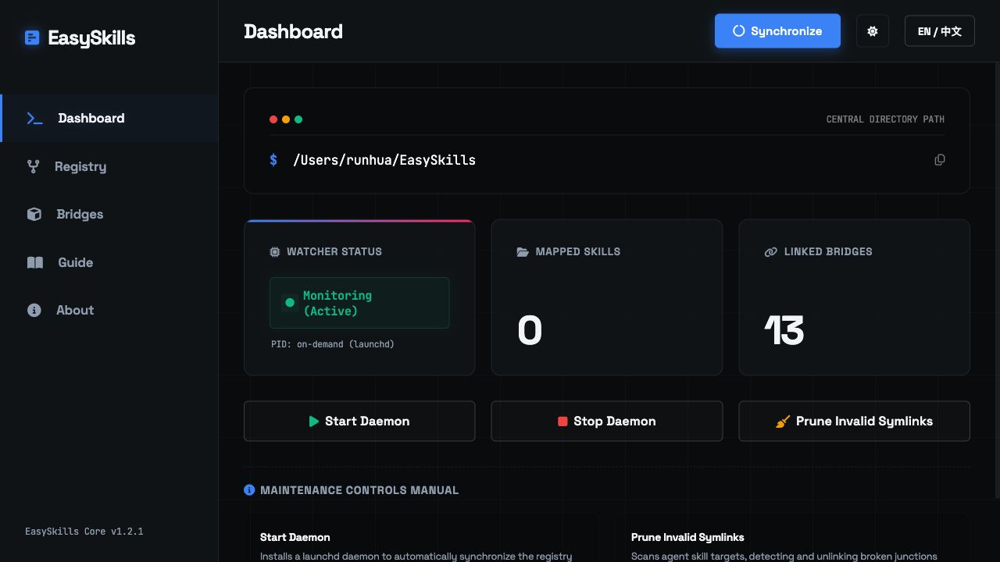
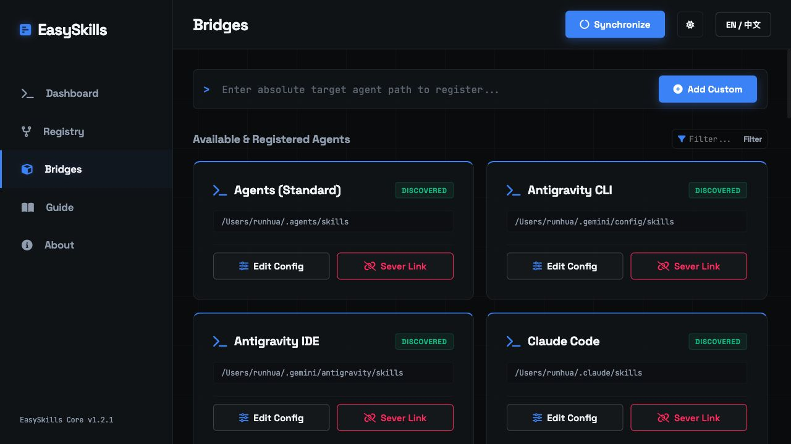

<div align="center">

# EasySkills

[](LICENSE)
[](#installation)
[](#supported-agents)
[](https://github.com/RunhuaHuang/EasySkills/releases)

**One skill library. Every agent. Always in sync.**

Drop a skill folder once into `~/EasySkills`.
It appears in Claude Code, Codex, Cursor, Gemini, Copilot, Windsurf, Trae, and 42+ more agent targets — instantly, through native links.

Local-first &bull; Zero idle CPU &bull; WebUI included

[**中文文档**](README.md)

</div>

---

## Quick Start

<table>
<tr>
<td><b>macOS / Linux</b></td>
<td>

```bash
curl -fsSL https://raw.githubusercontent.com/RunhuaHuang/EasySkills/main/install.sh | bash
```

</td>
</tr>
<tr>
<td><b>Windows</b></td>
<td>

```powershell
irm https://raw.githubusercontent.com/RunhuaHuang/EasySkills/main/install.ps1 | iex
```

</td>
</tr>
</table>

The installer creates `~/EasySkills`, detects supported agents, maps shared skills, starts the watcher, and launches the WebUI.

> **Alternative:** Clone this repo and double-click `install_mac.command` (macOS) or `install_windows.bat` (Windows).

---

## Open, Stop, Restart, and Update

Use the **Quick Start** commands above to deploy. After deployment, EasySkills installs the background watcher and automatically starts the local WebUI at `http://127.0.0.1:6633`. The terminal will show:

> Starting and mounting WebUI; the browser will open automatically when ready.

### Open the WebUI

The WebUI opens automatically after installation; use these commands later if you need to open it manually:

```bash
# macOS / Linux
bash ~/EasySkills/_maintenance/deploy.sh --webui

# Windows PowerShell
powershell -ExecutionPolicy Bypass -File "$env:USERPROFILE\EasySkills\_maintenance\deploy.ps1" -WebUI
```

### Stop

If you only want to close the dashboard, close the browser tab; background sync keeps running.

To stop the background watcher and WebUI service:

```bash
# macOS / Linux: stop the watcher
bash ~/EasySkills/_maintenance/deploy.sh --unwatch

# macOS: also stop the WebUI backend if needed
launchctl remove com.easyskills.webui 2>/dev/null || true
launchctl remove com.easyskills.webui.manual 2>/dev/null || true
pkill -f '[E]asySkills/_maintenance/webui.py' 2>/dev/null || true
pkill -f '[E]asySkills/_maintenance/webui-service.sh' 2>/dev/null || true
```

```powershell
# Windows: stop watcher and WebUI scheduled tasks
powershell -ExecutionPolicy Bypass -File "$env:USERPROFILE\EasySkills\_maintenance\deploy.ps1" -Unwatch
```

### Restart

```bash
# macOS / Linux
bash ~/EasySkills/_maintenance/deploy.sh --unwatch
bash ~/EasySkills/_maintenance/deploy.sh --watch
bash ~/EasySkills/_maintenance/deploy.sh --webui
```

```powershell
# Windows PowerShell
powershell -ExecutionPolicy Bypass -File "$env:USERPROFILE\EasySkills\_maintenance\deploy.ps1" -Unwatch
powershell -ExecutionPolicy Bypass -File "$env:USERPROFILE\EasySkills\_maintenance\deploy.ps1" -Watch
powershell -ExecutionPolicy Bypass -File "$env:USERPROFILE\EasySkills\_maintenance\deploy.ps1" -WebUI
```

### Update

Recommended: use **Check for updates / Update now** in the WebUI. Updates preserve custom agent paths, disconnected targets, and the WebUI token; the previous `_maintenance.bak` is kept for rollback.

You can also rerun the installer to upgrade in place:

```bash
# macOS / Linux
curl -fsSL https://raw.githubusercontent.com/RunhuaHuang/EasySkills/main/install.sh | bash
```

```powershell
# Windows PowerShell
irm https://raw.githubusercontent.com/RunhuaHuang/EasySkills/main/install.ps1 | iex
```

---

## How It Works

```
~/EasySkills/                           ← your single skill library
├── _maintenance/                       ← engine (invisible to agents)
├── MyAwesomeSkill/                     ← drop it here once
├── CodeReviewSkill/
└── DeployHelper/
        │
        ▼ symlink (macOS/Linux) / junction (Windows)
┌─────────────────────────────────────────────┐
│ ~/.claude/skills/MyAwesomeSkill  ──→  ✓     │
│ ~/.cursor/skills/MyAwesomeSkill  ──→  ✓     │
│ ~/.gemini/config/skills/MyAwesomeSkill ──→ ✓│
│ ~/.codex/skills/MyAwesomeSkill   ──→  ✓     │
│ ~/.copilot/skills/MyAwesomeSkill ──→  ✓     │
│ ... 42+ targets, all in sync, all the time  │
└─────────────────────────────────────────────┘
```

EasySkills maps each shared skill into agent-specific folders with native links — not copies. Edit a file once, every agent sees the change immediately. The watcher auto-syncs when you add or remove top-level skill folders. Agent-owned private skills are never touched.

---

## WebUI Dashboard

Manage everything from a local-only dashboard at `http://127.0.0.1:6633`.

Provides skill library import/delete, linked agents management, register unsupported agents by skills-folder path, manual sync, broken link cleanup, and update checks — all from one place.

```bash
# macOS / Linux
bash ~/EasySkills/_maintenance/deploy.sh --webui

# Windows (PowerShell)
powershell -ExecutionPolicy Bypass -File "$env:USERPROFILE\EasySkills\_maintenance\deploy.ps1" -WebUI
```

<p align="center">
  
</p>

<p align="center">
  
</p>

---

## Features

| | Feature | Details |
|:---:|:---|:---|
| **1** | **Skill library import/delete** | Import skill folders through the WebUI; delete with confirmation dialog. Manage linked agents visually |
| **2** | **Agent auto-discovery** | Detects 42+ mainstream agents and only links paths that actually exist |
| **3** | **Live mapping** | Watcher syncs skill additions/removals within seconds |
| **4** | **Non-invasive** | Shared skills sit beside agent-specific skills — private skills keep working |
| **5** | **Zero-privilege Windows** | NTFS directory junctions — no admin mode or Developer Mode needed |
| **6** | **Silent watcher** | `launchd` + `WatchPaths` (macOS) &bull; `systemd` path unit (Linux) &bull; Scheduled Task + hidden `FileSystemWatcher` (Windows) |
| **7** | **Local-first safety** | Skips existing real folders, uses file locks, listens on `127.0.0.1` only |
| **8** | **Concurrency protection** | PID lock (macOS) / named mutex (Windows) prevents overlapping syncs |

---

## CLI Reference

```bash
# macOS / Linux
bash ~/EasySkills/_maintenance/deploy.sh [option]

# Windows (PowerShell)
powershell -File "$env:USERPROFILE\EasySkills\_maintenance\deploy.ps1" [option]
```

| Option | Description |
|---|---|
| *(none)* / `--sync` | Sync all skills to all agents |
| `--list` | List all active mappings |
| `--add <path>` | Add & persist a custom agent path |
| `--remove <path>` | Remove a persisted custom path |
| `--watch` | Install background watcher |
| `--unwatch` | Uninstall background watcher |
| `--webui` | Start the local WebUI on port 6633 |
| `--cleanup` | Remove all EasySkills symlinks |
| `--help` | Show help |

> **Tip:** You can also add / remove custom paths visually from the **Agents** tab in the WebUI — no commands to memorize.

---

## Supported Agents

42+ agent targets are pre-configured. Custom paths can be added at any time via CLI, WebUI, or chat.

<details>
<summary><b>View full agent list</b></summary>

| # | Agent | macOS Path | Windows Path |
|:-:|:---|:---|:---|
| 1 | **Antigravity CLI** | `~/.gemini/config/skills` | `%USERPROFILE%\.gemini\config\skills` |
| 2 | **Antigravity IDE** | `~/.gemini/antigravity/skills` | `%USERPROFILE%\.gemini\antigravity\skills` |
| 3 | **Codex (OpenAI)** | `~/.codex/skills` | `%USERPROFILE%\.codex\skills` |
| 4 | **Claude Code** | `~/.claude/skills` | `%USERPROFILE%\.claude\skills` |
| 5 | **GitHub Copilot** | `~/.copilot/skills` | `%USERPROFILE%\.copilot\skills` |
| 6 | **Pi** | `~/.pi/agent/skills` | `%USERPROFILE%\.pi\agent\skills` |
| 7 | **OpenCode** | `~/.config/opencode/skills` | `%USERPROFILE%\.config\opencode\skills` |
| 8 | **Trae (Global)** | `~/.trae/skills` | `%USERPROFILE%\.trae\skills` |
| 9 | **Trae CN** | `~/.trae-cn/skills` | `%USERPROFILE%\.trae-cn\skills` |
| 10 | **Kimi Code (Moonshot)** | `~/.kimi/skills` | `%USERPROFILE%\.kimi\skills` |
| 11 | **ZCode** | `~/.zcode/skills` | `%USERPROFILE%\.zcode\skills` |
| 12 | **OpenClaw** | `~/.openclaw/skills` | `%USERPROFILE%\.openclaw\skills` |
| 13 | **Hermes Agent** | `~/.hermes/skills` | `%USERPROFILE%\.hermes\skills` |
| 14 | **Proma** | `~/.proma/default-skills` | `%USERPROFILE%\.proma\default-skills` |
| 15 | **Cursor** | `~/.cursor/skills` | `%USERPROFILE%\.cursor\skills` |
| 16 | **Kiro Agent (AWS)** | `~/.kiro/skills` | `%USERPROFILE%\.kiro\skills` |
| 17 | **Junie (JetBrains)** | `~/.junie/skills` | `%USERPROFILE%\.junie\skills` |
| 18 | **Cline** | `~/.cline/skills` | `%USERPROFILE%\.cline\skills` |
| 19 | **Roo Code** | `~/.roo/skills` | `%USERPROFILE%\.roo\skills` |
| 20 | **Warp** | `~/.warp/skills` | `%USERPROFILE%\.warp\skills` |
| 21 | **Windsurf** | `~/.codeium/windsurf/skills` | `%USERPROFILE%\.codeium\windsurf\skills` |
| 22 | **Firebender** | `~/.firebender/skills` | `%USERPROFILE%\.firebender\skills` |
| 23 | **Augment** | `~/.augment/skills` | `%USERPROFILE%\.augment\skills` |
| 24 | **Continue** | `~/.continue/skills` | `%USERPROFILE%\.continue\skills` |
| 25 | **Goose (Block/AAIF)** | `~/.config/goose/skills` | `%USERPROFILE%\.config\goose\skills` |
| 26 | **Agents (Standard)** | `~/.agents/skills` | `%USERPROFILE%\.agents\skills` |
| 27 | **Run** | `~/.run/global-skills/skills` | `%USERPROFILE%\.run\global-skills\skills` |
| 28 | **Qoder** | `~/.qoder/skills` | `%USERPROFILE%\.qoder\skills` |
| 29 | **Qwen Code** | `~/.qwen/skills` | `%USERPROFILE%\.qwen\skills` |
| 30 | **CodeBuddy** | `~/.codebuddy/skills` | `%USERPROFILE%\.codebuddy\skills` |
| 31 | **Amp** | `~/.config/agents/skills` | `%USERPROFILE%\.config\agents\skills` |
| 32 | **OpenHands** | `~/.openhands/skills` | `%USERPROFILE%\.openhands\skills` |
| 33 | **Kilo Code** | `~/.kilocode/skills` | `%USERPROFILE%\.kilocode\skills` |
| 34 | **Zencoder** | `~/.zencoder/skills` | `%USERPROFILE%\.zencoder\skills` |
| 35 | **iFlow CLI** | `~/.iflow/skills` | `%USERPROFILE%\.iflow\skills` |
| 36 | **Droid** | `~/.factory/skills` | `%USERPROFILE%\.factory\skills` |
| 37 | **Devin for Terminal** | `~/.config/devin/skills` | `%USERPROFILE%\.config\devin\skills` |
| 38 | **WorkBuddy** | `~/.workbuddy/skills` | `%USERPROFILE%\.workbuddy\skills` |
| 39 | **QClaw** | `~/.qclaw/skills` | `%USERPROFILE%\.qclaw\skills` |
| 40 | **CodeWhale** | `~/.codewhale/skills` | `%USERPROFILE%\.codewhale\skills` |
| 41 | **QoderWork CN** | `~/.qoderworkcn/skills` | `%USERPROFILE%\.qoderworkcn\skills` |
| 42 | **Qoder CN** | `~/.qoder-cn/skills` | `%USERPROFILE%\.qoder-cn\skills` |

> Trae and Trae CN also map to `~/Library/Application Support/Trae[-CN]/skills` (macOS) and `%APPDATA%\Trae[-CN]\skills` (Windows).

</details>

---

## Notes

**Windows Defender** — The installer can automatically add a Defender exclusion via UAC prompt. You can also manually whitelist `%USERPROFILE%\EasySkills` in Windows Security settings.

**Watcher Scope** — The watcher monitors only the **top-level** of `~/EasySkills` (folder additions/removals). It does not watch inside subdirectories — since skills are symlinked, internal file changes are instantly reflected everywhere without re-syncing. If `~/.proma` exists, EasySkills also polls Proma workspace `skills` folders every 5 minutes so new workspaces are picked up automatically.

---

## Contributing

To add support for a new agent:

1. Add an entry in `_maintenance/agents.json` (single source of truth)
2. Add the corresponding path to the hardcoded fallback arrays in `deploy.sh` and `deploy.ps1`
3. Update the agent tables in `README.md`, `README_EN.md`, and `README_SYSTEM.md`
4. Run tests: `python3 -m unittest _maintenance/tests/test_security_contracts.py`
5. Submit a pull request

---

## License

[MIT](LICENSE) &copy; 2026 Runhua Huang

---

<details>
<summary>Star History</summary>

<div align="center">

[](https://star-history.com/#RunhuaHuang/EasySkills&Date)

</div>

</details>
